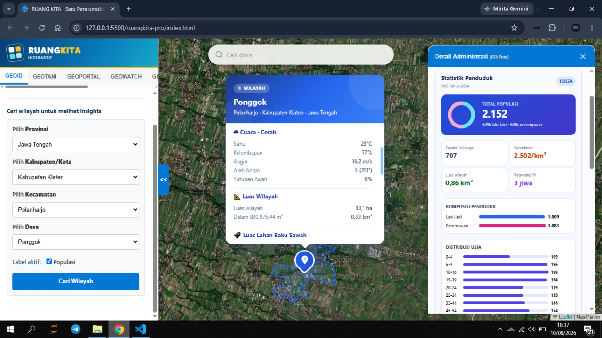

<div align="center">

# 🌏 RUANG KITA

### **Satu Peta untuk Nusantara** — *One Map for the Archipelago*


[](https://ruangkitainteraktif.github.io)

</div>

---

## 📖 Tentang / About

**RUANG KITA** adalah platform peta interaktif berbasis web untuk Indonesia. Mengintegrasikan data geospasial dari berbagai sumber pemerintah (BMKG, BIG, Kemendagri) ke dalam satu antarmuka yang mudah digunakan.

**RUANG KITA** is a web-based interactive map platform for Indonesia. It integrates geospatial data from various government sources (BMKG, BIG, Kemendagri) into a single, easy-to-use interface.

🌐 **Live Demo:** [https://ruangkitainteraktif.github.io](https://ruangkitainteraktif.github.io)

---

## 🖼️ Screenshot

<div align="center">



</div>

---

## ✨ Fitur / Features

### 🗺️ GEOID — Batas Wilayah Administrasi

- Pencarian bertingkat: Provinsi → Kabupaten/Kota → Kecamatan → Desa/Kelurahan
- Pencarian koordinat (Latitude, Longitude)
- Reverse geocode otomatis saat klik peta
- Tampilan batas wilayah dari **BIG** (Badan Informasi Geospasial)

*Hierarchical search: Province → Regency → District → Village. Automatic reverse geocode on map click. Administrative boundaries from BIG.*

### 🌤️ CUACA — Prakiraan Cuaca BMKG

- Prakiraan cuaca 3 hari ke depan dari BMKG
- Grafik prakiraan cuaca 3 hari per 3 jam
- Pencarian lokasi dengan autocomplete
- Insight cuaca (ikon, suhu, kelembapan, angin)

*3-day weather forecast from BMKG. 3-day / 3 hour weather forecast from BMKG. Location search with autocomplete.*

### 🔴 GEMPA — Data Gempa Real-time

- Gempa terkini dari BMKG
- Gempa signifikan (M5.0+)
- Gempa dirasakan
- Marker animasi dengan popup detail

*Real-time earthquake data from BMKG: latest, significant (M5.0+), and felt earthquakes with animated markers.*

### 🛠️ TOOLS — Alat Analisis GIS

- Gambar di peta: Titik, Garis, Poligon, Persegi, Lingkaran
- Pengukuran jarak dan luas area
- Export hasil gambar ke **GeoJSON**
- Import dan visualisasi file **GeoJSON**
- Import dan visualisasi **Shapefile** (.shp + .dbf + .shx)

*Drawing tools (marker, polyline, polygon, rectangle, circle). Distance and area measurement. GeoJSON/SHP import and visualization.*

### 🔍 Pencarian Terpadu / Unified Search

- Satu kolom pencarian untuk semua level administrasi
- Hasil instan dengan autocomplete

*Single search bar for all administrative levels with instant results.*

### 📊 Insight & Analisis / Insights & Analysis

- Jadwal sholat (Aladhan API)
- Fasilitas terdekat dari Overpass API (rumah sakit, sekolah, dll)
- Estimasi harga properti
- Luas wilayah dan lahan baku sawah

*Prayer schedule, nearby facilities (hospitals, schools, etc.), property price estimation, village area and rice field land analysis.*

---

## 🛠️ Teknologi / Technologies

| Teknologi | Versi | Kegunaan / Purpose |
|-----------|-------|-------------------|
| [Leaflet.js](https://leafletjs.com/) | 1.9.4 | Peta interaktif inti / Core interactive map |
| [Turf.js](https://turfjs.org/) | 7.1.0 | Analisis geospasial / Geospatial analysis |
| [Esri Leaflet](https://esri.github.io/esri-leaflet/) | 3.0.12 | Integrasi ArcGIS / ArcGIS integration |
| [proj4js](https://proj4js.github.io/) | 2.9.0 | Konversi proyeksi / Projection conversion |
| [Leaflet Draw](https://leaflet.github.io/Leaflet.draw/) | 1.0.4 | Alat menggambar / Drawing tools |
| [Leaflet MarkerCluster](https://leaflet.github.io/Leaflet.markercluster/) | 1.5.3 | Clustering marker / Marker clustering |
| [Leaflet LocateControl](https://leaflet.github.io/Leaflet.control.locate/) | 0.85.1 | Lokasi pengguna / User geolocation |

---

## 🚀 Cara Penggunaan / Getting Started

### Online / Daring

Kunjungi langsung: **[https://ruangkitainteraktif.github.io](https://ruangkitainteraktif.github.io)**

### Lokal / Local

```bash
# Clone repository
git clone https://github.com/ruangkitainteraktif/ruangkitainteraktif.github.io.git

# Buka folder
cd ruangkitainteraktif

# Buka index.html di browser
# Buka file langsung, tidak perlu build step
# Just open index.html in your browser - no build step required!
```

> 💡 **Catatan:** Karena menggunakan API eksternal, beberapa fitur memerlukan koneksi internet.
>
> *Note: Some features require an internet connection due to external API calls.*

---

## 📂 Struktur File / Project Structure

```
ruangkita/
├── index.html                     # Halaman utama / Main page
├── LICENSE                        # GPL-3.0
├── README.md
└── assets/
    ├── css/
    │   └── app.css                # Semua gaya CSS / All CSS styles
    ├── img/
    │   └── favicon.png            # Ikon aplikasi / App icon
    ├── data/
    │   ├── kode_wilayah.json      # Kode wilayah administrasi / Admin codes
    └── js/
        ├── map-core.js            # Inisialisasi peta / Map initialization
        ├── sidebar.js             # Navigasi sidebar / Sidebar navigation
        ├── geoid-wilayah.js       # Pencarian wilayah + insight / Area search + insights
        ├── weather-bmkg.js        # Data cuaca BMKG / BMKG weather data
        ├── weather-data.js        # Kode ADM4 + pencarian / ADM4 codes + search
        ├── earthquake.js          # Data gempa BMKG / BMKG earthquake data
        ├── map-click.js           # Handler klik peta / Map click handler
        ├── unified-search.js      # Pencarian terpadu / Unified search
        ├── alat-draw-measure.js   # Alat gambar & ukur / Drawing & measurement tools
        ├── alat-layers.js         # Import GeoJSON/SHP / GeoJSON/SHP import
        └── ...                    # 16+ modul JS lainnya / 16+ other JS modules
```

---

## 🤝 Kontribusi / Contributing

Kontribusi sangat diterima! Berikut cara berkontribusi:

Contributions are welcome! Here's how to contribute:

1. **Fork** repository ini
2. **Buat branch** baru: `git checkout -b fitur-baru`
3. **Commit** perubahan: `git commit -m 'Tambah fitur baru'`
4. **Push** ke branch: `git push origin fitur-baru`
5. **Buka Pull Request**

### Ide Kontribusi / Contribution Ideas

- 🐛 Bug fix
- ✨ Fitur baru
- 📝 Dokumentasi
- 🌐 Terjemahan
- 🎨 UI/UX improvement
- ⚡ Performa optimization

---

## 📄 Lisensi / License

Proyek ini dilisensikan di bawah **GNU General Public License v3.0** — lihat [LICENSE](LICENSE) untuk detail.

This project is licensed under the **GPL-3.0 License** — see [LICENSE](LICENSE) for details.

[](LICENSE)

---

## ❤️ Dukungan / Support

Jika proyek ini bermanfaat, dukunglah pengembangannya:

If this project is useful, consider supporting its development:

<a href="https://saweria.co/maspannn">
  
</a>
<a href="https://www.paypal.com/paypalme/panjidanutirto">
  
</a>

---

<div align="center">

**🌏 RUANG KITA**

<small>Satu Peta untuk Nusantara</small>

</div>
